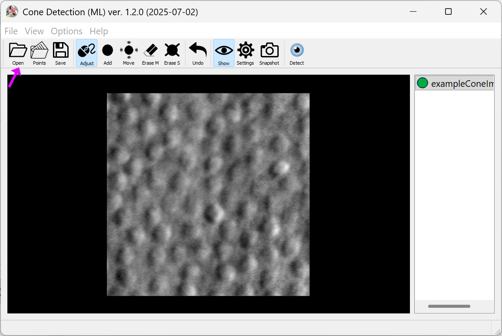
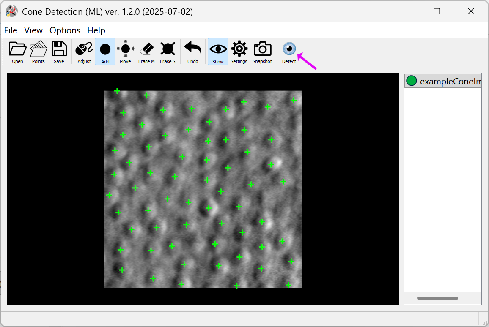
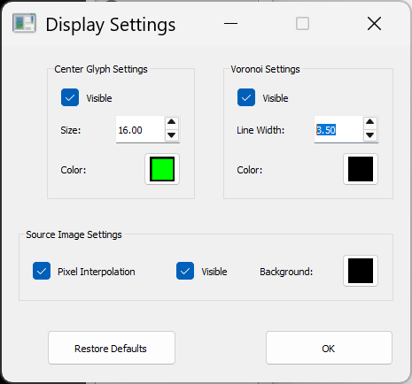
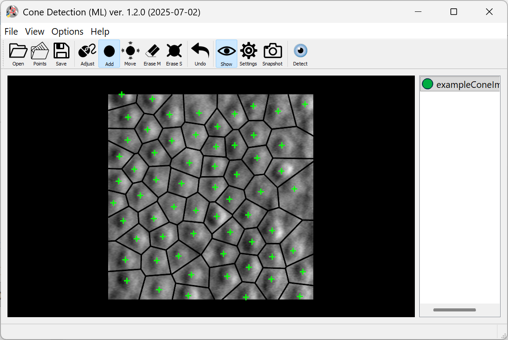
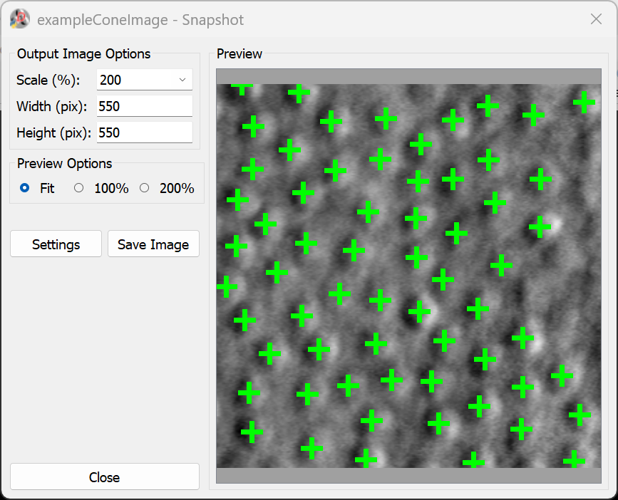

# Cone Detection ML

This tool performs detection of cone photoreceptors from non-confocal split detection.

## Usage and Features 
- Load an AO image by clicking on the **Open** button. Example AO images have been provided in the **test_data** folder in Github.
 
- Click on the **Detect** button to automatically detect the cones.
 
- The **Settings** tab provides options to display the centroids of the cones and also highlight the individual cone regions along with the contours.
 
 
- On the task bar, click on **File->Save** to save the annotations.
- The **Snapshot** feature allows users to save the current image with the applied annotations after selecting the desired output image size or scale.
 
- Interactive refinement

    - The **Mark** button allows adding annotations
    - The **Erase S** button erases a single annotation
    - The **Erase M** button erases multiple annotations
    - The **Undo** button undoes the previous operation
    - The **Move** button moves individual annotations to the desired location
    - The **Adjust** option controls image brightness and contrast. After activating this feature, left-click and drag vertically to adjust brightness, and drag horizontally to adjust contrast.

